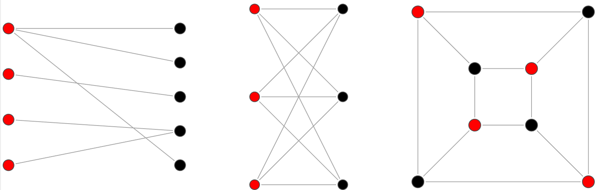

# Optimización continua

## Descripción y características de las funciones

### Sphere
[Sphere-Function](https://www.sfu.ca/~ssurjano/spheref.html).

Nuestra función contiene un único óptimo global, ya que es una función *unimodal*.

Se ha leído[[1]](https://xloptimizer.com/projects/toy-problems/sphere-function-pure-excel#:~:text=The%20sphere%20function%20is%20one,proposed%20modification%20of%20an%20algorithm.) *que nos ayuda a poder probar el rendimiento de un algoritmo o una propuesta de un algoritmo
modificado.*

También sabemos que la función es convexa, ya que si trazamos un segmento a través de ella, ningún punto por debajo del segmento podrá
sobre pasarlo.

Consideramos que al tener un **único óptimo global**, es muy difícil de optimizar, ya que aunque aumentemos de dimensión nuestra función,
siempre tendrá un óptimo único.

La imagen de la función asemeja a una sábana tomada en cada punta (extremo), por una persona.

### Ackley
[Ackley-Function](https://www.sfu.ca/~ssurjano/ackley.html)

Esta función fue presentada en las sesiones con el profesor y la ayudante. Podemos notar que tiene muchísimo mínimos locales.

También encontramos que la función es no convexa[[2]](https://en.wikipedia.org/wiki/Ackley_function), por lo que nos difículta poder encontrar
los mínimos locales dada una superficie de trabajo.

Lo más curioso de está función es que su **único óptimo global** se encuentra en el punto $f(0,0)=0$.

Creemos que aumentar o disminuir la dimensión de la función mantiene su alta dificultad, ya que siempre tendremos múltiples mínimos locales,
incluso si trabajaramos en un *espacio bidimensional* tendríamos complicaciones con encontrar el mínimo local.

### Griewank
[Griewank-Function](https://www.sfu.ca/~ssurjano/griewank.html)

Esta función también fue presentada en la ayudantía con Malinali, pudimos observar que también tiene varios mínimos locales, pero
estos son generalizados y se distribuyen de manera regular.

La dimensión nos ayuda a alterar su dificultad, ya que entre menor sea dicha dimensión, mucho más fácil es de analizar la función y de
esta manera podemos encontrar la distribución de sus mínimos.

Su **óptimo global** depende de su distribución, pero al ser regulares siempre se mantiene con múltiples óptimos a lo largo de la función.

### Tenth Power 

Esta función es una modificación presentada por la *función Sphere*, su diferencia es que nuestra variable está elevada a la potencia 10.

Esto quiere decir que mantendrá las mismas propiedades que la *función Sphere*.

### Rastrigin
[Rastrigin-Function](https://www.sfu.ca/~ssurjano/rastr.html)

La función es presentada con muchísimos minimos locales, por lo que es altamente modal, pero algo que la caracteriza es que sus localidades
mínimas son distribuidas de manera regular.

La función será dificil de optimizar si buscamos justamente estos mínimos, pero altamente fácil si queremos encontrar los máximos.

La dimensión nos ayuda a alterar su dificultad si buscamos máximos, pero se nos dificultará si buscamos los mínimos por sus propiedades.

Al igual que la función **Ackley** su óptimo local se encuentra en el cuadrante 0.

### Rosenbrock
[Rosenbrock-Function](https://www.sfu.ca/~ssurjano/rosen.html)

La función de Rosenbrock es unimodal, por lo que el mínimo global residirá muy cerca del valle parábolico.

Es muy fácil encontrar este el mínimo local en esta función y hemos encontrado que es muy popular para las pruebas
de *optimización por gradientes*.

## Esquema de codificación

### Tamaño de búsqueda

## Búsqueda aleatoria

## Tabla 

 

| **Funcion**  | **Dimension**  |  **Mejor valor f(x)** | **Valor promedio f(x)** | **Peor valor f(x)** |
|---|---|---|---|---|
|  Sphere | --- |---|---|---|
|  Sphere | --- |---|---|---|
|  Sphere | --- |---|---|---|
|  Ackley | --- |---|---|---|
|  Ackley | --- |---|---|---|
|  Ackley | --- |---|---|---|
|  Griewank | --- |---|---|---|
|  Griewank | --- |---|---|---|
|  Griewank | --- |---|---|---|
|  TenthPowerFunction | --- |---|---|---|
|  TenthPowerFunction | --- |---|---|---|
|  TenthPowerFunction | --- |---|---|---|
|  Rastrigin | --- |---|---|---|
|  Rastrigin | --- |---|---|---|
|  Rastrigin | --- |---|---|---|
|  Rosenbrock | --- |---|---|---|
|  Rosenbrock | --- |---|---|---|
|  Rosenbrock | --- |---|---|---|

 

# Optimización combinatoria

Cómo primer ejemplo de problema de combinación optimataría, lo que 
haremos será proponer el problema de *Gráfica bipartita*.

El cuál describimos de la siguiente manera:

**Llamamos *gráfica bipartita* o sólo *bigráfica* es un conjunto de 
vertices de una gráfica descompuestos en dos conjuntos disjuntos, del
modo que no hay dos vértices de una gráfica adyacente dentro del 
mismo conjunto.**

Podemos mostrar un ejemplo donde la *k-partición* de una grafica con
*k=2*.

## Codificación binaria

Nuestra codificación para poder representar una gráfica será 
sencilla, por lo cuál usaremos una matriz de adyacencias, esto en
particular es excelente para nuestro problema, debido a que 
justamente buscamos conjunstos disjuntos dentro de *G*.

Por lo que la codificación será de la siguiente manera:

[//]: <> (TODO: Codificación con ejemplo visual)

### Espacio de la búsqueda

[//]: <> (TODO: Espacio de búqueda)

### Función objetivo

[//]: <> (TODO: Función objetivo)

### Tamaño del espacio de búsqueda

[//]: <> (TODO: Tamaño del espacio)

### Ejemplar concreto del problema

[//]: <> (TODO: Ejemplar del problema)

### Ejemplo de solución

[//]: <> (TODO: Ejemplo de solución)

## Vector de valores discretos

### Espacio de la búsqueda

### Función objetivo

### Tamaño del espacio de búsqueda

### Ejemplar concreto del problema

### Ejemplo de solución

## Permutaciones 

### Espacio de la búsqueda

### Función objetivo

### Tamaño del espacio de búsqueda

### Ejemplar concreto del problema

### Ejemplo de solución